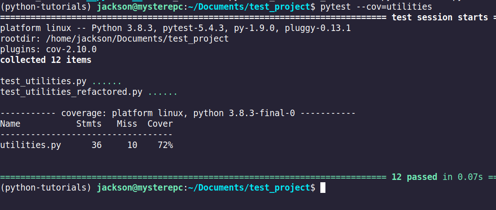

#%% md
Tests et Profilage, Python
==========================

#%% md
Le présent tutoriel vise à éclaircir certains concepts reliés aux tests en
programmation et à mettre l'emphase sur les bonnes pratiques d'assurance
qualité en Python. Nous allons également investiguer comment profiler son code
afin de déterminer la performance.

#%% md

Tests unitaires 
---------------
Le pilier principale de l'assurance qualité en progammation
est les tests unitaires. Les tests unitaires ont comme objectif de vérifier que
mon code fait ce qu'il est censé faire.  

#%% md
Les tests unitaires sont composés de 4 étapes:
1. Préparation (`setUp`): les composantes nécessaires pour le test sont
   instanciées.  
2. Exercice: L'unité de code testée est lancée.
3. Vérification: Le sortant de l'unité de code en question est comparé à sa
   valeur anticipé.
4. Ramassage (`tearDown`): les composantes nécessaires pour le test sont
   détruits. 

#%% md
Un test unitaire est générallement conçu afin d'isoler une unité de code. Il
est important de découpler les tests unitaires.   Nous allons commencer par
nous habituer à la structure générale des tests. Le premier exemple est le
script `utilities.py` et sa classe de tests dans `test_utilities.py`.  

#%% 

class TestUtilities:
    """
    Cette classe est un exemple classique de tests cases du type xUnit. 
    Les méthodes setup_class/teardown_class sont appelées automatiquement au début et à la fin des tests unitaire appertenant à cette classe.
    """ 
    @classmethod
    def setup_class(cls):
        cls.converter = StringConverters()

    @classmethod
    def teardown_class(cls):
        pass

    def test_translate_to_jadensmith_raises_value_error(self):
        with pytest.raises(ValueError):
            self.converter.translate_to_jadensmith(999)

    ....

#%% md
Nous
retrouvons la structure habituelle des tests avec une classe de test. Remarquer
que la classe commence par le mot-clé `Test` ce qui permet au module pytest de
l'inclure. De plus, les tests dans la classe commence tous par le prefix `test_
` pour la même raison.

#%% md
Pytest 
------ 

#%% md
Pytest nous permet de lancer nos tests et de voir le résultat
avec un résumé graphique sur la ligne de commande. La commande est `pytest
<votre_fichier_de_test.py> `.

#%% md
Il y a plusieurs options utiles pour commencer
tels que `-s` qui permet d'afficher le _standard out_ (les print statements,
sinon ils ne sont pas imprimés puisque pytest capture l'ensemble des sortants
des tests.

#%% md
Pytest est un des principal module de test dans Python. Il supporte les tests
unitaires classiques comme nous venons juste de voir. De plus, il permet de
gérer les tests différamment avec des _fixture_. Nous allons refactoriser la
classe TestUtilities afin d'utiliser les _fixture_.  
Le ficher est *test_utilities_refactored.py*

#%% 

@pytest.fixture(autouse=True, scope='module')
def create_converter():
    converter = StringConverters()
    yield converter

def test_translate_to_jadensmith_raises_value_error(create_converter):
    with pytest.raises(ValueError):
        create_converter.translate_to_jadensmith(999)

def test_translate_to_jadensmith_single_word(create_converter):
    sentence = "bonjour"
    expected_value = "Bonjour"

    actual_value = create_converter.translate_to_jadensmith(sentence)

    assert expected_value == actual_value
Les _fixtures_ sont une fonctionnalité très puissante de pytest. 

#%% md
Pytest Coverage
---------------
#%% md
_pytest-cov_ est un module supplémentaire nous permettant de visualiser la
proportion du code testée. Il est facile de se restreindre à seulement quelques
chemin possible par le code. Par exemple. si j'ai le code suivant:
#%% 
if first_name == "":
   if last_name == "":
        db.set_name("unknown")
   else:
        db.set_name(last_name)
else:
    if last_name == "":
        db.set_name(first_name + "_unknown")
    else:
        db.set_name(first_name +  " " + last_name) 
#%% md
Nous devons écrire soit 4 tests ou bien un test parcourant les 4 chemins.
Un module comme _pytest-cov_ nous permet de calculer la proportion du code qui
est réellement testé.
#%% md
La commande est `pytest --cov=<nom du module> <test_directory>`

#%% md
La photo précédente démontre le résultat d'une couverture de test.
